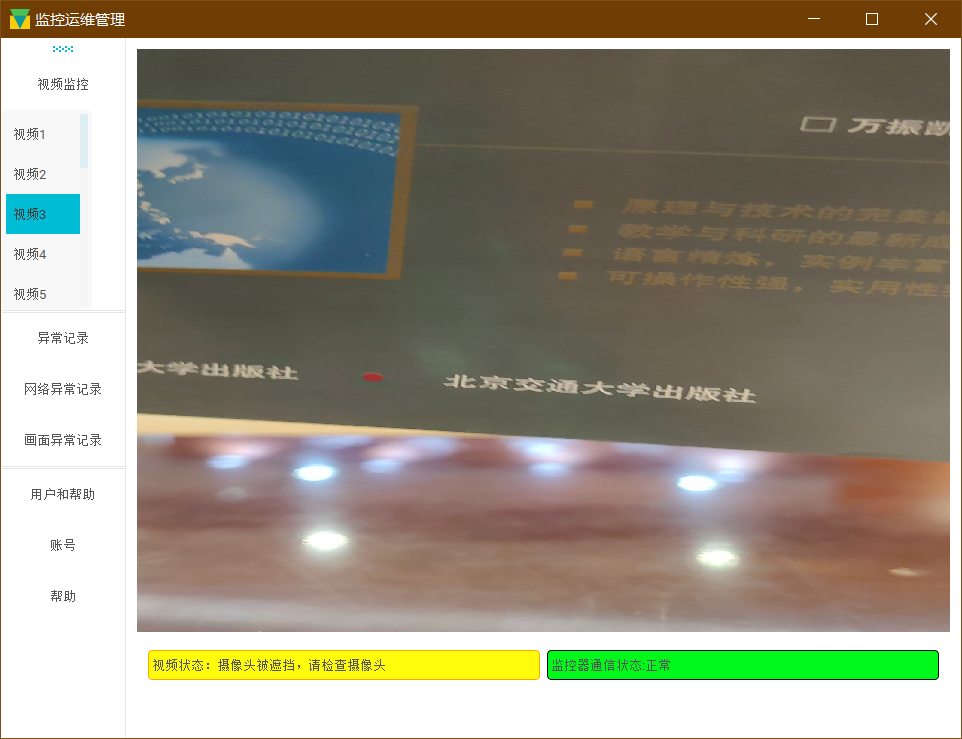

# 用Python QT写的毕业设计项目
## 描述
毕业设计题目是：视频摄像头运维管理系统的设计与实现。项目设计实现了一个视频监控管理系统，包含用户登录、用户管理、监控监视、摄像头异常自动告警、网络拥塞自动告警以及存储告警日志等功能，同时本文提出了一种摄像头异常自动检测算法。该算法可以在无人干预的情况下，
自动检测摄像头遮挡、移动、花屏、画面静止和抖动的情况并发出告警，能有效降低运维人员的负担。以上系统通过测试实现了对视频监控摄像头的自动化管理，提高了视频监控摄像头的运维水平和效率。

## 特点
- 界面采用 material design 谷歌设计风格。
- 提出了一种摄像头异常自动检测算法，有效减少管理员工作量。
  
## 项目截图

